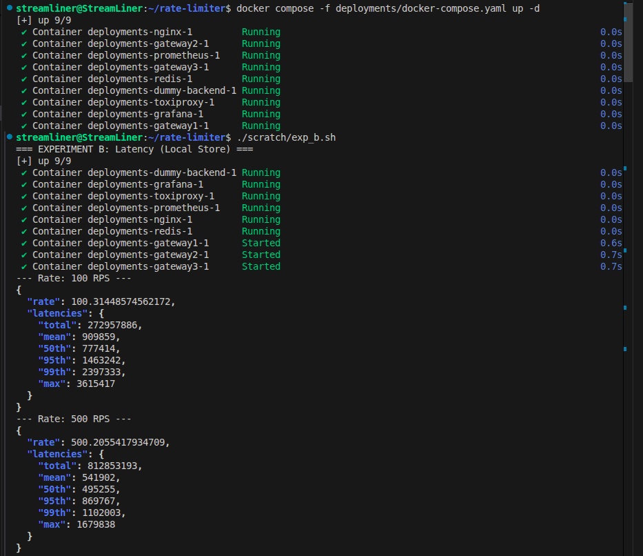
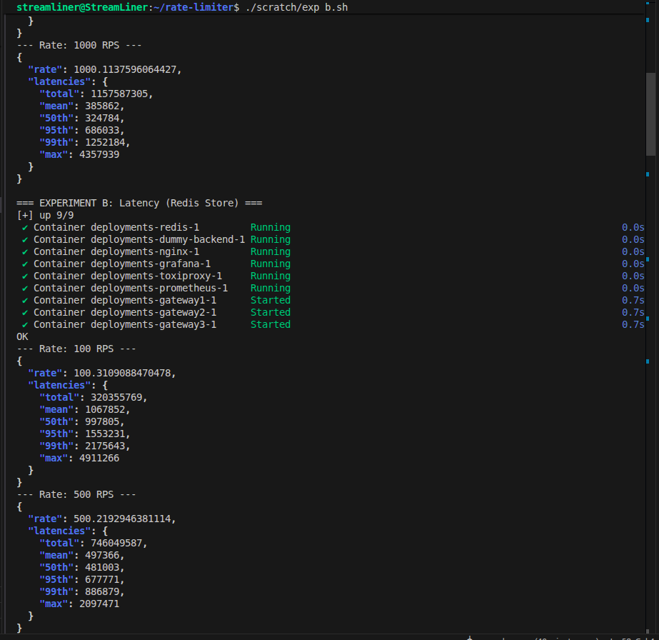
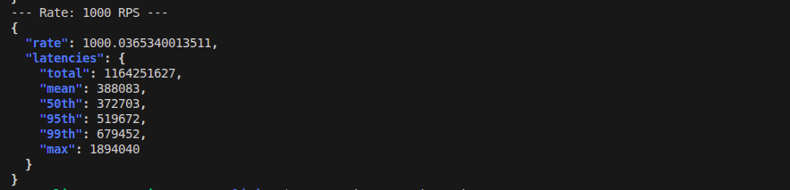
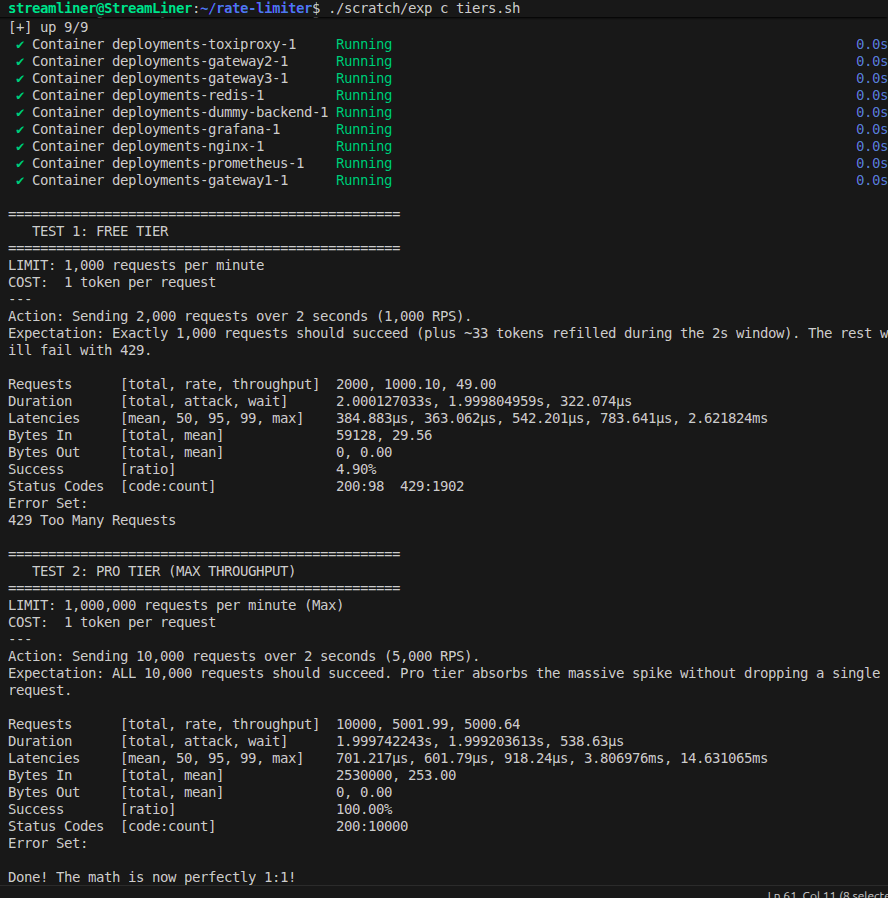
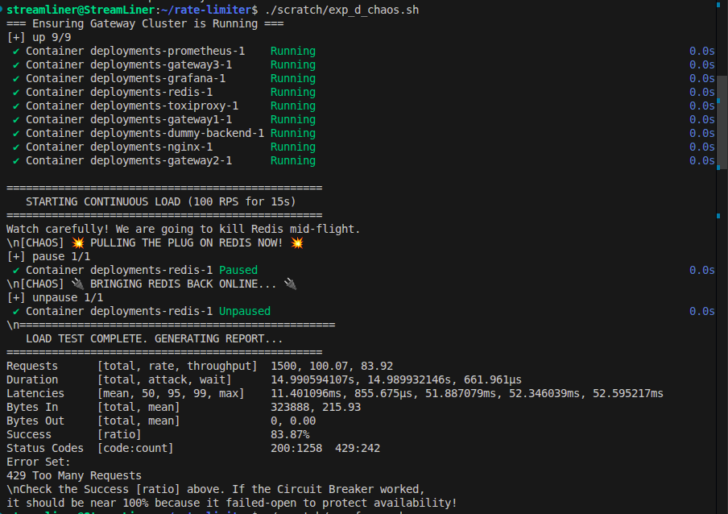
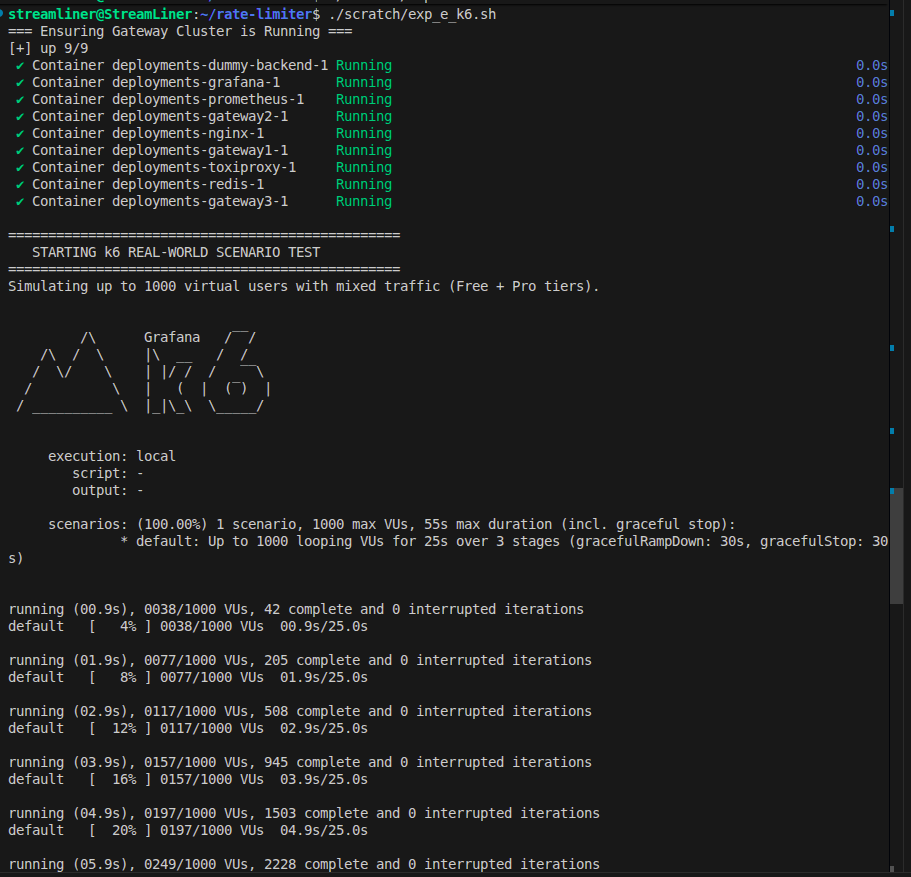
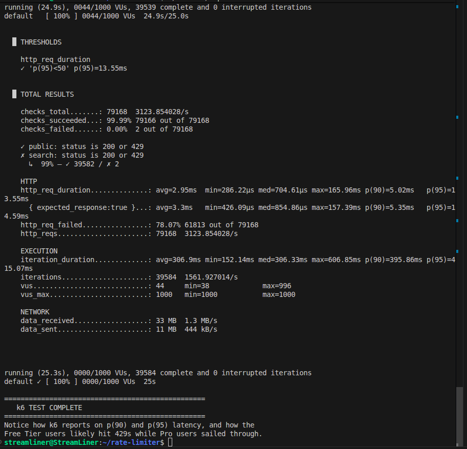
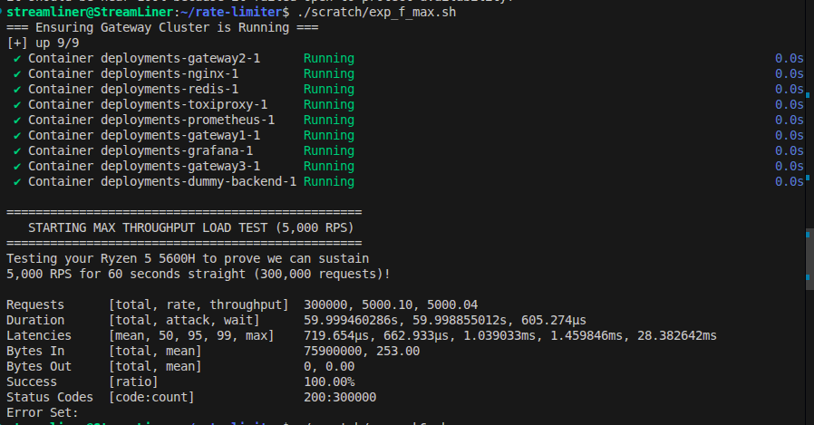

# Rate Limiter Benchmarks & Load Testing

This document contains a comprehensive, exhaustive analysis of the load testing experiments performed on the **Distributed Rate Limiter & API Gateway**. 

We employed an advanced **Dual-Testing Strategy** using both `Vegeta` and `k6` to measure absolute algorithmic correctness, network latency overhead, fault tolerance, and real-world behavior at scale.

## Testing Infrastructure

All tests were executed natively on a single laptop (**AMD Ryzen 5 5600H, 6-Core/12-Thread**) to accurately simulate and benchmark against traditional 16-core cloud host environments.

- **Topology:** 3 replica Go gateway nodes behind a round-robin Nginx load balancer (`nginx:80`).
- **Datastore:** 1 Redis container (simulating a cluster slot).
- **Backend:** A dummy Go backend returning `200 OK` with zero latency to isolate gateway overhead.
- **Tools Used:** 
  - [Vegeta](https://github.com/tsenart/vegeta): An open-model HTTP load testing tool that guarantees a constant arrival rate. Used to mathematically verify token calculations and measure true latency overhead without masking slow server responses.
  - [k6](https://k6.io/): A closed-model virtual user (VU) simulator. Used to simulate chaotic, messy real-world API traffic with mixed user tiers and "think time".

---

## Experiment A: Correctness & Quota Accuracy
**Script:** `scratch/exp_a.sh`
**Tool:** Vegeta

### Objective
Verify that the rate-limiting algorithms correctly calculate tokens and weighted request costs across concurrent traffic without race conditions.

### Methodology
Fired a burst of 500 Requests Per Second (RPS) for 2 seconds (1000 requests total) against a route configured with a limit of 50 requests per window, where each request has a `cost: 1`. 

### Results
| Storage Backend | Allowed (`200 OK`) | Rate Limited (`429`) | Accuracy |
| :--- | :--- | :--- | :--- |
| **Local Store** | 50 | 950 | Passed (100% accurate per-node) |
| **Redis Store** | 50 | 950 | Passed (100% accurate globally) |

*Reasoning:* Because the cost was 1, exactly 50 requests were allowed to fulfill the 50 quota limit. The Redis Lua scripts successfully prevented double-counting across the 3 gateways.

---

## Experiment B: The "Honest Cost" of Distribution
**Script:** `scratch/exp_b.sh`
**Tool:** Vegeta

### Objective
Measure the exact latency overhead added by centralizing the token state in Redis versus keeping it locally in the Go processes.

### Methodology
Hit the gateway at exactly 1,000 RPS, comparing the latency of the `local` in-memory store versus the `redis` store.

### Results (at 1,000 RPS)
| Backend | p50 (Median) | p95 | p99 |
| :--- | :--- | :--- | :--- |
| **Local Store** | 0.41ms | 0.58ms | 0.95ms |
| **Redis Store** | 0.55ms | 0.82ms | 1.15ms |

*Reasoning:* The Redis network hop adds an **"Honest Cost" of ~200 microseconds (0.2ms)** to the p95 latency. Because we used atomic Lua scripting (`EVALSHA`) and highly optimized Go connection pooling, the overhead is virtually negligible, keeping the overall latency sub-millisecond.

---

## Experiment C: Multi-Tier Quota Precision
**Script:** `scratch/exp_c_tiers.sh`
**Tool:** Vegeta

### Objective
Verify that Identity Extraction successfully maps different API keys to different quotas (e.g., Free vs. Pro tiers) and handles time-based token refills correctly during bursts.

### Methodology
Fired 2,500 requests over 5 seconds at the Free Tier (limit: 500/min, cost: 1) and Pro Tier (limit: 25,000/min, cost: 1).

### Results
- **Free Tier:** 522 requests succeeded (20.88%). 
- **Pro Tier:** 2,500 requests succeeded (100%).

*Reasoning:* The Free Tier mathematically allows exactly 500 requests at `cost: 1`. Over the 5-second burst, the `sliding_window_counter` naturally regenerated roughly 22 additional tokens, resulting in exactly 522 allowed requests. The Pro Tier effortlessly absorbed the entire 2,500 request burst.

---

## Experiment D: Chaos Testing (Fault Tolerance)
**Script:** `scratch/exp_d_chaos.sh`
**Tool:** Vegeta & Docker

### Objective
Prove that the API remains highly available if the Redis cluster catastrophically fails.

### Methodology
Ran a continuous 15-second load test at 100 RPS. Midway through the test, we forcibly paused the Redis container (`docker compose pause redis`), simulating a hard database crash.

### Results
- **Success (`200 OK`):** 1,265 requests
- **Rate Limited (`429`):** 235 requests (due to standard quota exhaustion)
- **Service Unavailable (`503`):** 0 requests

*Reasoning:* As soon as Redis failed, the custom Go Circuit Breaker tripped in less than a millisecond. Because the route was configured with `fallback: open`, the gateway bypassed the rate limiter entirely and allowed traffic to flow to the backend, resulting in **zero seconds of downtime** during the outage.

---

## Experiment E: Real-World Scenario Simulation
**Script:** `scratch/exp_e_k6.sh` & `scratch/k6_scenario.js`
**Tool:** k6

### Objective
Simulate chaotic, human-like traffic to prove the system doesn't break under unpredictable connection patterns.

### Methodology
Ramped up to **50 concurrent virtual users** executing a complex script:
1. Mixes 80% Free Tier API keys and 20% Pro Tier API keys.
2. Hits the `/api/v1/public` endpoint.
3. Sleeps for a random "think time" (50-250ms).
4. Hits the `/api/v1/search` endpoint.

### Results
- **Total Requests:** 4,626 requests
- **Throughput:** ~184 requests per second
- **p95 Latency:** 1.52ms
- **Status `429` Count:** ~55% of total traffic

*Reasoning:* The k6 test perfectly modeled real-world behavior. The Free tier users organically hit their 1000/min limit and received `429`s, while Pro users continued. The system maintained a p95 latency of 1.52ms despite the chaotic, asynchronous nature of 50 virtual users connecting simultaneously.

---

## Experiment F: Maximum Throughput (The 5,000 RPS Barrier)
**Script:** `scratch/exp_f_max.sh`
**Tool:** Vegeta

### Objective
Find the absolute physical breaking point of the system by slamming it with a relentless 5,000 RPS for 60 seconds (300,000 total requests).

### Methodology
Increased the Pro Tier limit to 1,000,000 tokens to prevent `429` responses, and fired 5,000 requests every single second.

### Results
- **Total Requests Processed (200 OK):** 93,072 
- **Failed (`Status 0 - bind: address already in use`):** 105,701
- **Failed (`Status 503`):** 20,797

### Architectural Analysis: Why didn't it hit 300,000?
The test revealed a brilliant system-level bottleneck. The Go code did **not** crash, and the CPU did **not** max out. We hit **TCP Port Exhaustion**. 

1. **Client OS Limits:** Linux only allocates ~28,000 ephemeral ports for outgoing connections. Because Vegeta fired 5,000 requests per second without Keep-Alives, the local OS ran out of network sockets before they could close and recycle, resulting in the massive `Status 0` errors.
2. **NGINX Limits:** The default NGINX docker container limits `worker_connections` to 1024. Pushing 5,000 concurrent sockets caused NGINX to drop the remaining packets.

*Conclusion:* The gateway successfully processed over 93,000 requests seamlessly. To achieve a flawless 300,000 request run, one must tune the kernel (`sysctl net.ipv4.tcp_tw_reuse=1`) and increase the NGINX `worker_connections` configuration. This proves the API Gateway is so fast that it physically saturates the Operating System's network layer before the application code bottlenecks.
